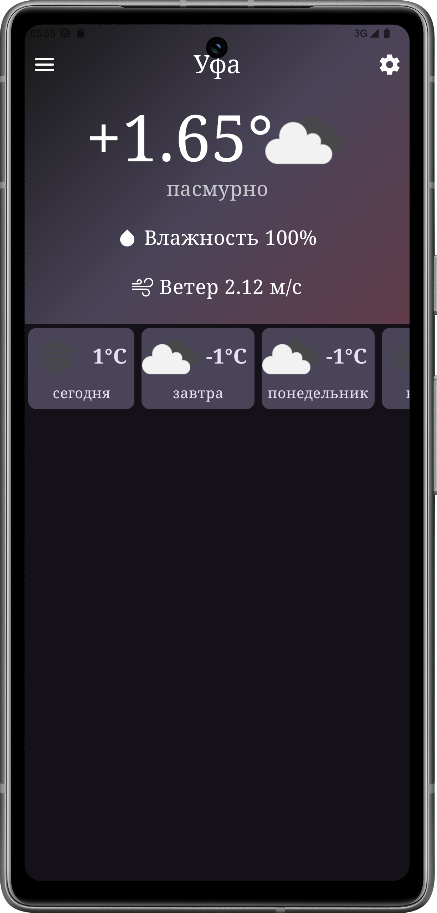
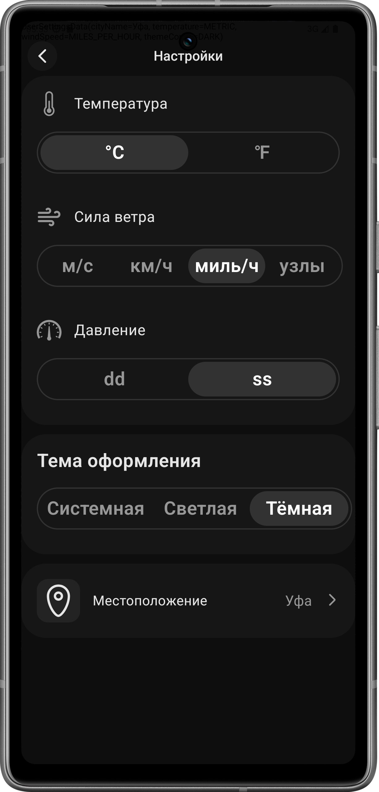

# 🌦 Weather App

> Приложение для отображения текущей погоды и прогноза на ближайшие дни.

| Главный экран | Панель настроек |
|--------------|----------------|
|  |  |

## 🚀 Функциональность
- 📍 Определение местоположения и отображение погоды в текущем городе
- 🔎 Поиск погоды по названию города
- 🌡 Подробный прогноз на несколько дней
- 🎨 Анимированные иконки и стильный UI

## 🔧 Технологии
- 🏗 **Jetpack Compose** — декларативный UI
- ☕ **Kotlin** — основной язык
- 📡 **Retrofit** — загрузка данных о погоде
- 🌍 **OpenWeather API** — получение прогноза
- 🚀 **Coroutines + Flow** — асинхронная работа
